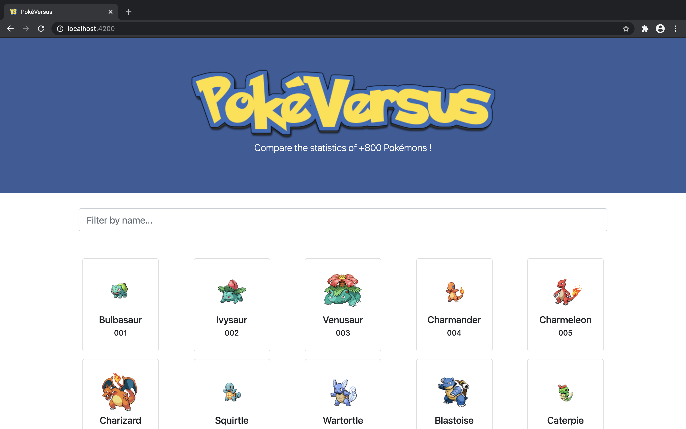

# PokéVersus

[](https://app.netlify.com/sites/epic-galileo-fa287c/deploys)



Pokémon comparator WebApp made with Angular, Bootstrap, Cache API and PokéAPI.

## Live version

https://epic-galileo-fa287c.netlify.app/

## Installation

```
$ git clone https://gitlab.com/wdestin/pokeversus.git
$ cd pokeversus
$ npm install
```

## Development server

Run `ng serve` for a dev server. Navigate to `http://localhost:4200/`. The app will automatically reload if you change any of the source files.

## Build

Run `ng build` to build the project. The build artifacts will be stored in the dist/ directory. Use the --prod flag for a production build.
